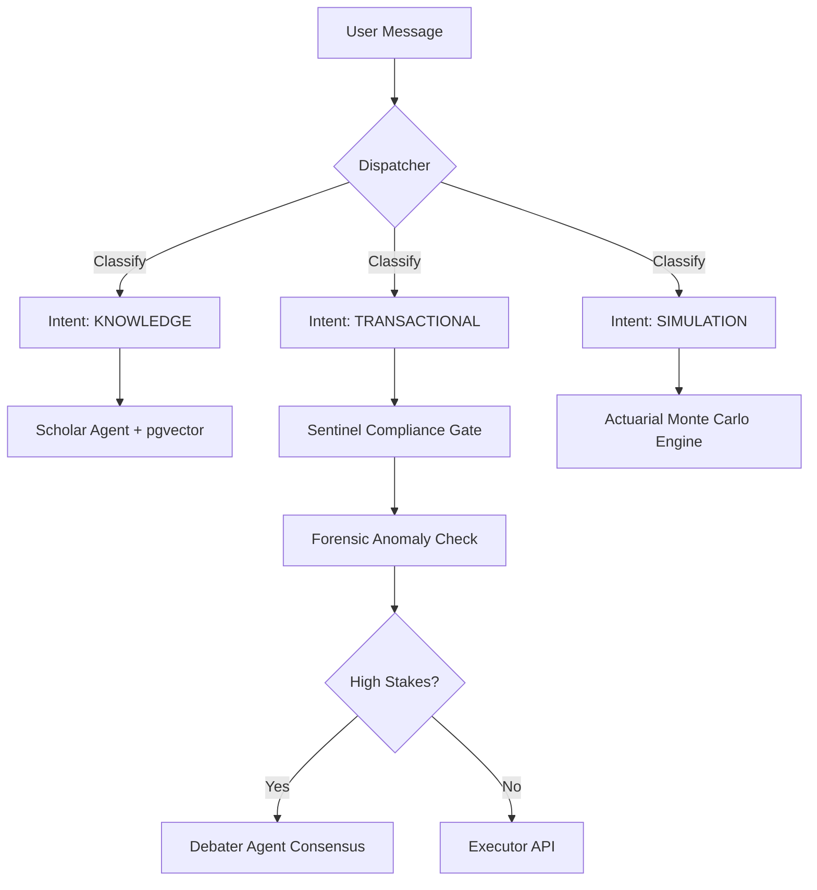

<div align="center">
  
  
  # RetireIQ: Bank-Grade Agentic AI
  
  **Local-First. Cloud-Scale. Multi-Agent Ecosystem for Retirement Resilience.**
  
  [](https://www.python.org/)
  [](https://flask.palletsprojects.com/)
  [](https://github.com/pgvector/pgvector)
  [](https://cloud.google.com/vertex-ai)
  [](https://openai.com/)

  RetireIQ is a sophisticated, production-grade conversational intelligence platform designed to revolutionize retirement planning. It combines a **Local-First** development philosophy with **Cloud-Scale** agentic orchestration, ensuring financial data is handled with bank-grade security, mathematical precision, and regulatory transparency.
</div>

---

## ⚡ Features at a Glance

| 🤖 Agentic Core | 🛡️ Security | 📊 Actuarial Math | 📡 Observability |
| :--- | :--- | :--- | :--- |
| **Multi-Agent Ensemble**: Specialized agents (Oracle, Scholar, Debater) with weighted consensus logic. | **Leak-Proof RAG**: Strict PII sanitization and re-hydration proxy layers for cloud-safe AI. | **Monte Carlo Engine**: High-fidelity retirement projections and "what-if" scenario planning. | **Agent Historian**: Deep audit trails capturing every agentic thought, observation, and action. |
| **Domain Authority**: Task-specific model selection (Gemini for RAG, GPT-4 for Logic/Math). | **Compliance Gates**: Sentinel-driven pre-trade checks and forensic anomaly detection. | **Real-Time Intel**: Oracle-injected market context and live ticker quotes for grounded advice. | **Semantic Routing**: High-speed intent classification and multimodal dispatch via Orchestrator. |

---

## 📖 Table of Contents

- [🚀 Why RetireIQ?](#why-retireiq)
- [🏗️ Agentic Ecosystem](#agentic-ecosystem)
- [🏛️ Architecture Overview](#architecture-overview)
- [💎 Design & Core Philosophy](#design--core-philosophy)
- [⚖️ The RetireIQ Difference](#the-retireiq-difference)
- [🛡️ Bank-Grade Security](#bank-grade-security)
- [λ Expert Ensemble (The Debater)](#expert-ensemble-the-debater)
- [⚙️ Getting Started](#getting-started)
- [📂 Project Structure](#project-structure)
- [📡 Agent Historian & Auditing](#agent-historian--auditing)
- [📝 Configuration Reference](#configuration-reference)
- [🧪 Testing & Local-First](#testing--local-first)
- [📄 License](#license)
- [🤝 Contributing](#contributing)

---

## 🚀 Why RetireIQ?

Retirement planning is complex, high-stakes, and deeply personal. Standard LLM wrappers fail because they lack domain specificity, context grounding, and security guardrails.

**RetireIQ transforms financial advisory into a resilient digital experience:**

*   **Intelligent Orchestration**: Doesn't just "chat"—it dispatches queries to a team of specialized agents.
*   **Grounded in Reality**: Uses RAG with `pgvector` to ensure every answer is backed by verified policies.
*   **Compliance-First**: Every transaction or high-stakes advice passes through multiple deterministic security gates.
*   **Privacy-Preserving**: Designed to keep PII within secure boundaries using local-first sanitization proxies.

> [!IMPORTANT]
> **Zero-Leak Policy**: RetireIQ ensures that sensitive financial data (PII) is never leaked to third-party LLM providers. It uses a sanitization layer that replaces PII with tokens before cloud dispatch and re-hydrates them locally.

> [!NOTE]
> **Vision**: To provide a "Glass Box" financial assistant where every recommendation is transparent, audited, and mathematically sound.

---

## 🏗️ Agentic Ecosystem

RetireIQ is powered by a "Council of Agents," each a specialist in its own domain.

| Agent | Specialist Domain | Key Functionality |
| :--- | :--- | :--- |
| **Dispatcher** | **The Router** | Semantic intent classification and orchestration. |
| **Scholar** | **Knowledge/RAG** | Semantic retrieval from policy docs using `pgvector`. |
| **Sentinel** | **Compliance** | Pre-trade compliance checks (Concentration, Suitability). |
| **Actuarial** | **Simulation** | Monte Carlo retirement projections and actuarial math. |
| **Oracle** | **Market Intel** | Real-time economic indicators and ticker quotes. |
| **Debater** | **Consensus** | Weighted ensemble reasoning for high-stakes decisions. |
| **Forensic** | **Investigator** | Anomaly detection and transaction risk scoring. |
| **Empath** | **Behavioral** | Sentiment analysis and adaptive tone management. |
| **Guardian** | **The Shield** | Conversational guardrails against jailbreaks and off-topic queries. |

---

## Architecture Overview

RetireIQ uses an **Application Factory** pattern for modularity and scalability.


### The Dispatcher Flow


---

## λ Expert Ensemble (The Debater)

For high-stakes scenarios (e.g., large withdrawals or contradictory advice), RetireIQ triggers the **Debater Agent**. This is a weighted consensus engine that runs multiple models in parallel to ensure "Bank-Grade" accuracy.

### Domain Authority Logic
Weights are dynamically adjusted based on the query domain:
- **Model A (Gemini 1.5 Pro)**: Primary authority (90% weight) for Knowledge Base & RAG.
- **Model B (GPT-4o)**: Primary authority (90% weight) for Transactional Logic & Math.
- **Model C (Llama 3)**: Independent local viewpoint (33% weight) for general consensus.

---

## 🛡️ Bank-Grade Security

RetireIQ implements a "Shielded API" pattern to ensure financial data remains private.

### 1. PII Sanitization & Re-hydration
Before any text is sent to a cloud LLM, names, account numbers, and balances are replaced with cryptographic tokens. The LLM's response is **re-hydrated** with the original values only after it returns to the secure local environment.

### 2. Sentinel Compliance Rules
Unlike LLMs, the Sentinel uses deterministic code to enforce strict financial rules:
- **Concentration Limit**: Blocks trades that exceed 10% of total portfolio value.
- **Suitability Check**: Ensures trade risk levels match the user's declared tolerance.
- **Age Restriction**: Blocks pension drawdowns for users under the legal age (e.g., 55).

---

## 📡 Agent Historian & Auditing

RetireIQ doesn't just provide answers; it provides **justification**. Every interaction is recorded in the `AgentAudit` table, capturing the "Chain of Thought":

| Step Type | Description | Example |
| :--- | :--- | :--- |
| **THOUGHT** | Internal reasoning process. | "User wants to retire at 60; checking current assets." |
| **OBSERVATION** | Data retrieved from a tool. | "Retrieved policy chunk: 'Section 4.2 - Early Drawdown'." |
| **ACTION** | Final decision or execution. | "Executing Monte Carlo simulation with 1000 trials." |

---

## ⚙️ Getting Started

### Prerequisites
- **Python 3.11+**
- **Docker & Docker Compose** (for pgvector and local LLMs)
- **Make** (standard build tool)
- **Ollama** (optional, for local model execution)

### Quick Start
```bash
# 1. Clone and Configure
git clone https://github.com/sumitsr/retireiq.git
cd retireiq
cp .env.example .env

# 2. Launch Ecosystem
make up           # Starts API, Database (pgvector), and UI

# 3. Seed Knowledge Base
make seed         # Ingests retirement policy docs into pgvector
```

### Building from Source
```bash
make build        # Docker build all images
make test         # Run unit and integration tests
make logs          # Follow agentic logic in real-time
```

---

## 📂 Project Structure

```
retireiq/
├── app/
│   ├── routes/           # API Endpoints (Chat, Profile, System)
│   ├── services/         # The Agent Council (Orchestrator, Scholar, Debater...)
│   ├── models/           # SQLAlchemy Data Models (Audit, User, Knowledge)
│   ├── guardrails/       # Custom security and content filters
│   └── utils/            # Shared helpers (PII Sanitization, Metrics)
├── docs/                 # Technical Deep-Dives & Architectural Blueprints
├── scripts/              # Data ingestion and maintenance tools
├── tests/                # Enterprise-grade test suite
└── docker-compose.yml    # Full-stack local orchestration
```

---

## 📄 License

This project is **Proprietary and Confidential**. See the [LICENSE](LICENSE) file for full legal details.

Copyright (c) 2026 Sumit Srivastava.

---

## 🤝 Contributing

As a "Bank-Grade" system, contributions must adhere to strict security and testing standards.
1. Fork and create your feature branch (`git checkout -b feature/security-hardening`).
2. Ensure 100% test coverage for new logic.
3. Submit a PR for architectural review.
