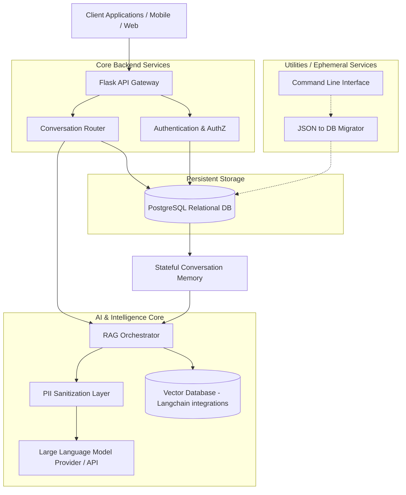

# RetireIQ Backend Architecture

RetireIQ is a modern, modular backend system built using Flask and SQLAlchemy, aimed at supporting a bank-grade conversational AI experience with advanced Retrieval-Augmented Generation (RAG) capabilities.

## High-Level Architecture Diagram

## Core Components
1. **Flask App Factory Pattern**: A modular monolith approach designed to easily support extensions, blueprints, and modular testing boundaries.
2. **SQLAlchemy ORM**: Handles relational schemas (users, financial profiles, chat logs, states) and encapsulates the legacy migration logic from previous JSON-file datastores.
3. **Conversational Memory**: A robust stateful layer appending context arrays for contextualized and continuous multi-turn conversations.
4. **PII Sanitization Gateway**: An enterprise-grade intermediate screening service handling data anonymization before external transmission, critical for financial data integrity.
