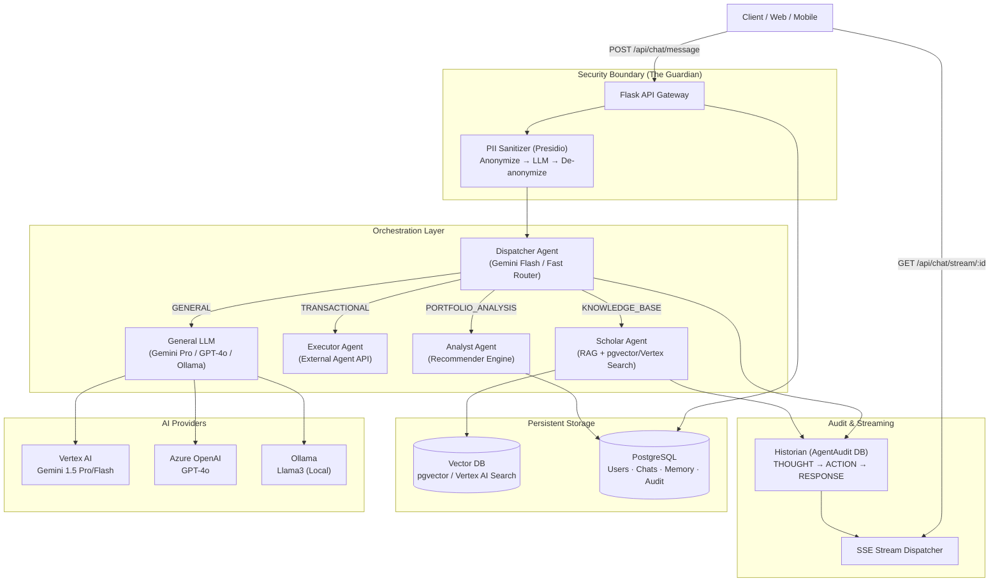

# RetireIQ Backend Architecture

RetireIQ is a "Bank-Grade" retirement planning assistant built on a production-grade Multi-Agent System (MAS). It uses a Dispatcher/Orchestrator pattern with specialized agents for knowledge retrieval, portfolio analysis, and financial transactions — all backed by a granular Audit Sentinel ("The Historian") for full transparency.

---

## High-Level Architecture: Multi-Agent System (MAS)

---

## Core Components

### 1. Flask App Factory (`app/__init__.py`)
Modular monolith using Blueprints. New agents and routes can be added without touching the core. Registers all SQLAlchemy models (including `AgentAudit`) at startup.

### 2. Orchestrator / Dispatcher (`app/services/orchestrator.py`)
The central nervous system. Uses a **fast model** (Gemini Flash) to classify user intent into domains, then hands off to the correct specialized service. Prevents "Instruction Bleed" — each agent only receives its relevant tools.

### 3. Historian / Audit Sentinel (`app/services/audit_service.py` + `app/models/audit.py`)
Every agentic step is persisted:
- `session_id`: Links all steps for a single request.
- `agent_name`: Which agent acted (Dispatcher, Scholar, Guardian...).
- `step_type`: `THOUGHT`, `ACTION`, `OBSERVATION`, or `RESPONSE`.
- `content`: The raw reasoning text.

### 4. Stream Dispatcher / SSE Hub (`app/services/sse_service.py`)
Thread-safe event hub. The Historian's `log_step` broadcasts simultaneously to the client's SSE stream, enabling real-time "Chain of Thought" visualization.

### 5. PII Sanitization Gateway (`app/utils/pii_sanitizer.py`)
Bank-grade data protection using **Microsoft Presidio**. Custom recognizers for `SSN` and `ACCOUNT_NUMBER`. Operates as a symmetric proxy: anonymizes before the LLM call, de-anonymizes after.

### 6. Knowledge Service (`app/services/knowledge_service.py`)
Manages semantic search via `pgvector` (local) or `Vertex AI text-embedding-004` (cloud). Also includes `VertexCacheManager` for **Context Caching** — reduces input token costs by up to **90%** for large, frequently-accessed policy corpora.

### 7. Memory Service (`app/services/memory_service.py`)
Stateful conversational memory. After each conversation, `summarize_into_facts` runs in a background thread to extract long-term preferences (risk tolerance, goals) into `UserMemory`.

---

## Data Models

| Model | Table | Purpose |
|-------|-------|---------|
| `User` | `users` | Core profile, financial data, preferences |
| `Conversation` | `conversations` | Groups messages by session |
| `Message` | `messages` | Individual user/bot turns |
| `UserMemory` | `user_memory` | Long-term extracted facts |
| `KnowledgeChunk` | `knowledge_chunks` | RAG document store + embeddings |
| `Product` | `products` | Financial product catalog |
| **`AgentAudit`** | **`agent_audit`** | **High-fidelity agentic audit trail** |

---

## Provider Switching

Configure via environment variables — no code changes required:

| `LLM_PROVIDER` | Model | Use Case |
|----------------|-------|---------|
| `vertex_ai` | Gemini 1.5 Pro/Flash | Production (GCP) |
| `azure_openai` | GPT-4o | Enterprise (Azure) |
| `openai` | GPT-4o | Cloud (OpenAI) |
| `ollama` | Llama3 | Local Dev (Zero Cost) |
