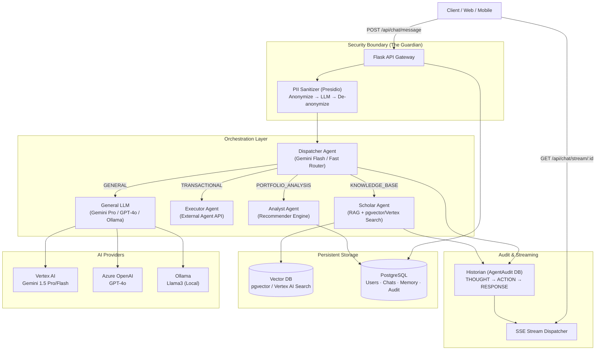
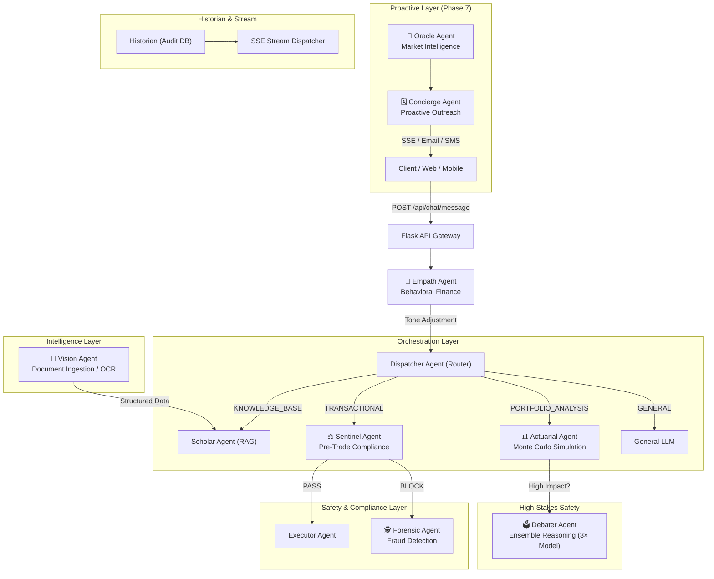

# RetireIQ Backend Architecture

RetireIQ is a "Bank-Grade" retirement planning assistant built on a production-grade Multi-Agent System (MAS). It uses a Dispatcher/Orchestrator pattern with specialized agents for knowledge retrieval, portfolio analysis, and financial transactions — all backed by a granular Audit Sentinel ("The Historian") for full transparency.

---

## Current Architecture: Multi-Agent System (MAS)

---

## Future Architecture: The Autonomous Agent Ecosystem (Phase 7)

The current architecture covers the **reactive** dimension. The Phase 7 agents add **proactive**, **preventive**, and **predictive** dimensions.

---

## Core Components (Current)

### 1. Flask App Factory (`app/__init__.py`)
Modular monolith using Blueprints. Registers all SQLAlchemy models (including `AgentAudit`) at startup.

### 2. Orchestrator / Dispatcher (`app/services/orchestrator.py`)
The central nervous system. Uses Gemini Flash (T=0.0) to classify user intent into domains, then delegates to specialists via `_classify_intent` → `_parse_intent_response` → `_route`.

### 3. Historian / Audit Sentinel (`app/services/audit_service.py` + `app/models/audit.py`)
Every agentic step is persisted with `session_id`, `agent_name`, `step_type` (THOUGHT/ACTION/OBSERVATION/RESPONSE), and `content`.

### 4. Stream Dispatcher / SSE Hub (`app/services/sse_service.py`)
Thread-safe event hub. All Historian log steps simultaneously broadcast to the client's SSE stream. Heartbeat pings every 20s prevent proxy timeouts.

### 5. PII Sanitization Gateway (`app/utils/pii_sanitizer.py`)
Bank-grade proxy using Microsoft Presidio. Custom recognizers for `SSN` and `ACCOUNT_NUMBER`. Symmetric: anonymise → LLM → de-anonymise (the "Ghost Map" pattern). Session-isolated via `clear_mapping()`.

### 6. Knowledge Service (`app/services/knowledge_service.py`)
Semantic search via `pgvector` (local) or Vertex AI `text-embedding-004` (cloud). Includes `VertexCacheManager` for 90% input token reduction on repeated large policy lookups.

### 7. Memory Service (`app/services/memory_service.py`)
Background fact extraction from conversation history into `UserMemory`. Runs in a daemon thread after each conversation turn.

---

## Planned Agents (Phase 7)

| Agent | Role | Priority | Pattern |
|-------|------|---------|---------|
| **Sentinel** | Pre-trade compliance & regulatory rules engine | 🔴 Must-have | Pre-Executor filter |
| **Actuarial** | Monte Carlo retirement success simulation | 🔴 Must-have | Compute-intensive background task |
| **Vision** | OCR & document ingestion of pension statements | 🟡 High | Upload endpoint + Document AI |
| **Empath** | Behavioral finance sentiment + tone adjustment | 🟡 High | Pre-Dispatcher message analysis |
| **Concierge** | Proactive outreach for deadlines & opportunities | 🟡 High | Scheduled worker + SSE/email/SMS |
| **Oracle** | Real-time market intelligence & portfolio alerts | 🟢 Strategic | APScheduler + market data feeds |
| **Debater** | Ensemble reasoning (3× independent model instances) | 🟢 Strategic | Parallel threads + Moderator |
| **Forensic** | Fraud detection via anomaly scoring | 🟢 Long-term | Isolation Forest + velocity tracking |

---

## Data Models

| Model | Table | Purpose |
|-------|-------|---------|
| `User` | `users` | Core profile, financial data, preferences |
| `Conversation` | `conversations` | Groups messages by session |
| `Message` | `messages` | Individual user/bot turns |
| `UserMemory` | `user_memory` | Long-term extracted facts |
| `KnowledgeChunk` | `knowledge_chunks` | RAG document store + embeddings |
| `Product` | `products` | Financial product catalog |
| **`AgentAudit`** | **`agent_audit`** | **High-fidelity agentic audit trail** |

---

## Provider Switching

| `LLM_PROVIDER` | Model | Use Case |
|----------------|-------|---------|
| `vertex_ai` | Gemini 1.5 Pro/Flash | Production (GCP) |
| `azure_openai` | GPT-4o | Enterprise (Azure, PCI DSS) |
| `openai` | GPT-4o | Cloud (OpenAI) |
| `ollama` | Llama3 | Local Dev (Zero Cost) |
