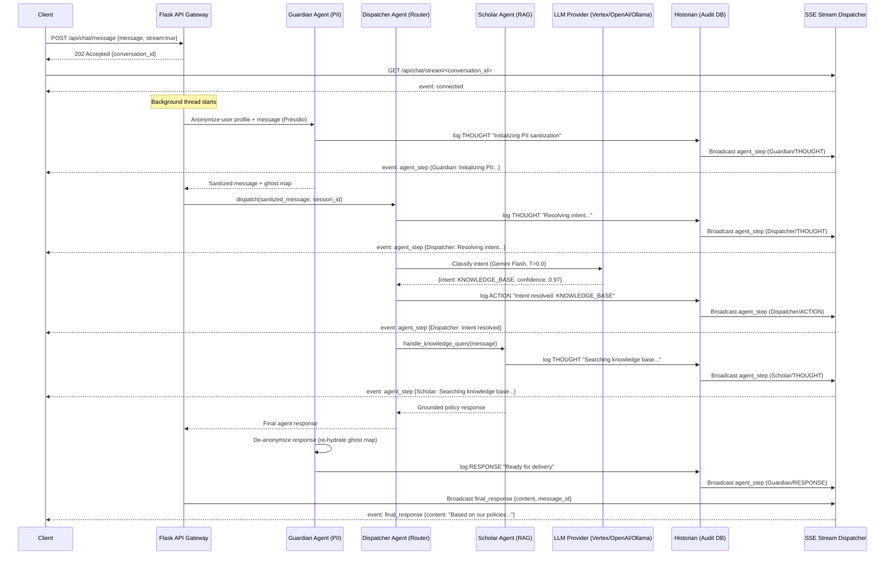
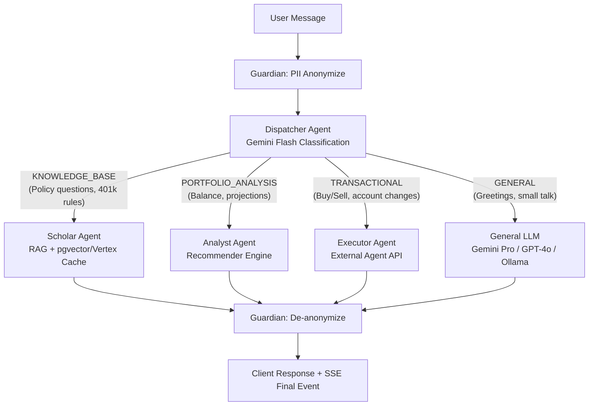
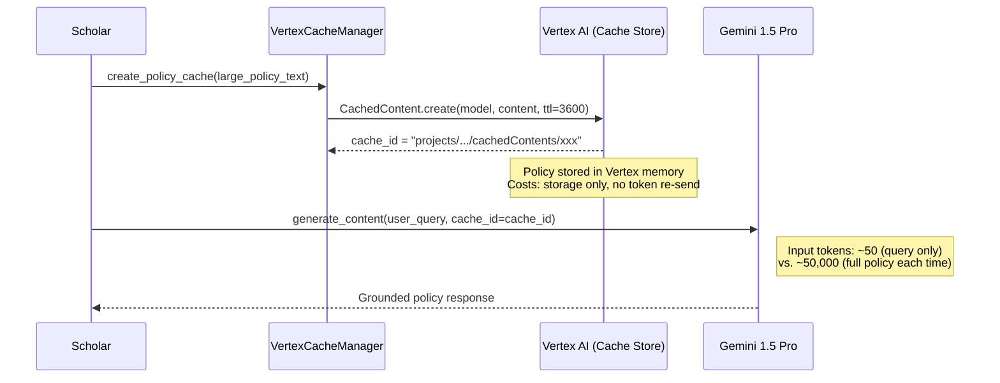
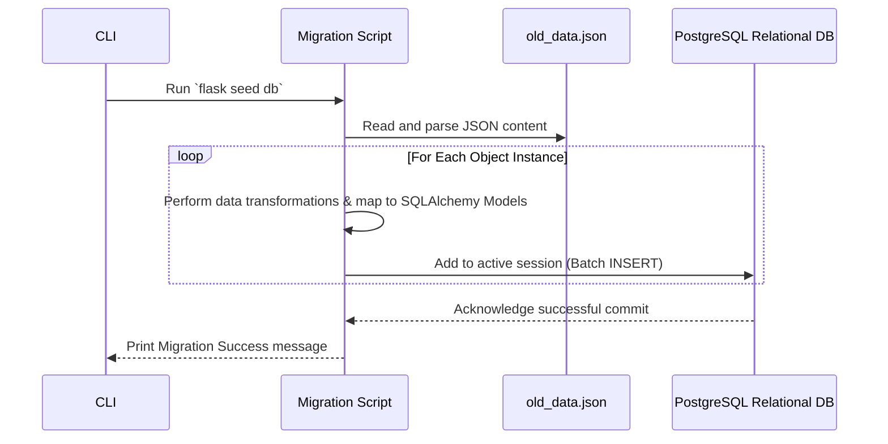

# Application Sequence Diagrams

The following flows show the lifecycle of typical requests in the RetireIQ Multi-Agent System.

---

## 1. Full Agentic Chat Flow (MAS with SSE Streaming)

This flow demonstrates the complete end-to-end pipeline through the Dispatcher, Historian, and SSE stream.

---

## 2. Intent Classification: Dispatcher Branch Logic

This flow shows how the Dispatcher routes different intent types.

---

## 3. Context Caching Flow (Scholar Agent + Vertex AI)

This flow shows the 90% token reduction pattern for large policy documents.

---

## 4. Legacy Data Migration Flow

This sequence visualizes the historical shift from unstructured JSONs to structured SQL.

