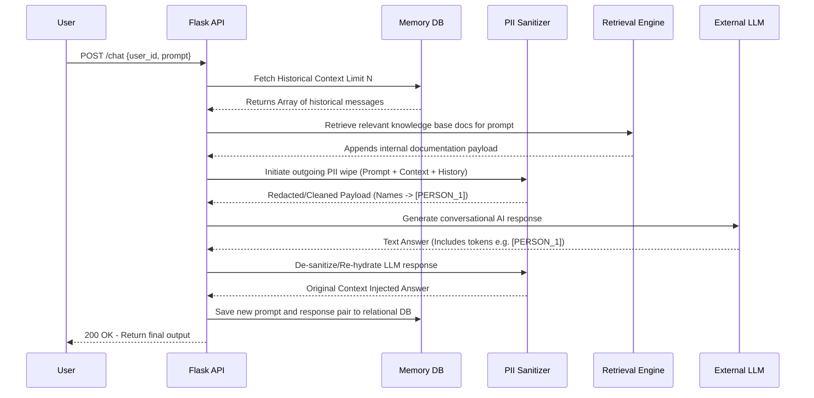
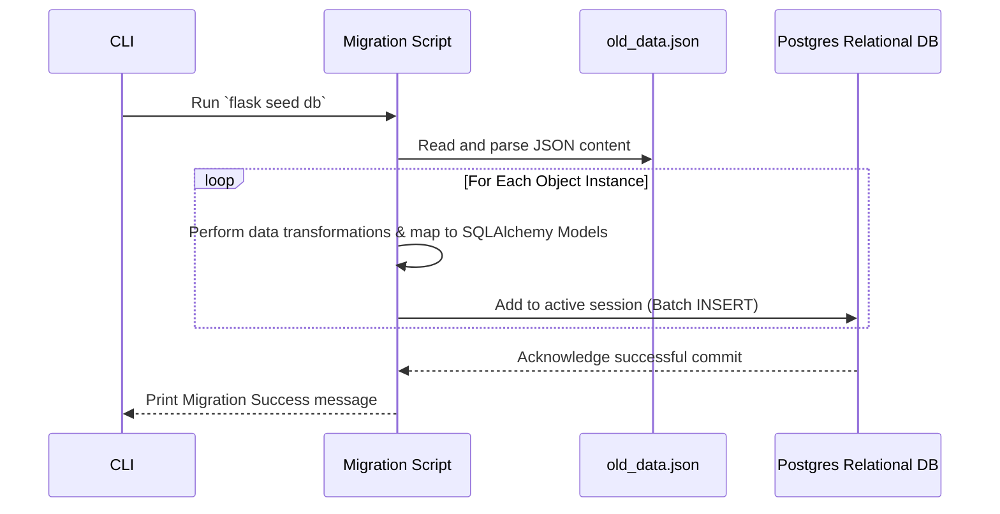

# Application Sequence Diagrams

The following flows show the lifecycle of typical requests in the RetireIQ system.

## 1. Chat Execution Flow with RAG & Conversational Memory

This flow demonstrates the end-to-end multi-turn conversation layer.

## 2. Legacy Data Migration Flow

This sequence visualizes the shift from unstructured JSONs to structured SQL.

