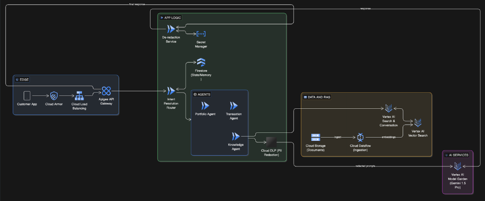

# System Design: Secure RetireIQ (GenAI) Architecture and costing on GCP

## 1. High-Level Architecture (GCP Mapping)
This architecture maps logical intent-based workflows to native Google Cloud services for enterprise-grade scalability and security.



### Component Mapping
| Mermaid Logic | GCP Service | Role |
| :--- | :--- | :--- |
| **Gateway & Auth** | **Apigee / Cloud Armor** | Security, rate limiting, and API management. |
| **Intent Resolution** | **Cloud Run** | Serverless orchestration and routing logic. |
| **State Db** | **Cloud Firestore** | Low-latency NoSQL for session/chat history. |
| **Vector Database** | **Vertex AI Vector Search** | High-scale vector similarity matching. |
| **Knowledge Agent** | **Vertex AI Search** | Managed RAG capabilities for document retrieval. |
| **PII Redaction** | **Sensitive Data Protection (DLP)** | Automated masking/de-identification of PII. |
| **LLM Core** | **Vertex AI (Gemini 1.5 Pro)** | The central intelligence and reasoning engine. |

---

## 2. Estimated Monthly Cost Breakdown
*Estimates based on ~1 Million requests/month and ~50GB of processed text data.*

| Category | Service | Monthly Cost (Est.) |
| :--- | :--- | :--- |
| **Networking** | Apigee + Load Balancing | $0 - $200 |
| **Compute** | Cloud Run (Agents & Router) | $10 - $25 |
| **Database** | Firestore (Session Memory) | $5 - $15 |
| **RAG/Vector** | Vertex AI Vector Search | $150 - $300 |
| **AI Models** | Gemini 1.5 Pro (Tokens) | $215 - $350 |
| **Security** | Cloud DLP (PII Redaction) | $100 - $300 |
| **TOTAL** | | **$480 - $1,190** |

---

## 3. Cost Optimization Strategy (Burn-Rate Reduction)

To reduce the monthly bill by **30-50%**, implement the following:

### A. Infrastructure & RAG
* **AlloyDB for PostgreSQL:** Replace Vertex AI Vector Search with AlloyDB (using `pgvector`). This avoids high "always-on" node costs and allows scaling based on actual database usage.
* **Scale-to-Zero:** Ensure all Cloud Run services have `min-instances` set to `0` to avoid charges during idle periods.

### B. LLM Token Efficiency
* **Context Caching:** For the Knowledge Agent, use **Vertex AI Context Caching** for frequently accessed document sets. This reduces input token costs by up to **90%** for repeated queries.
* **Model Tiering:** Use **Gemini 1.5 Flash** for simple intent routing and **Gemini 1.5 Pro** only for final, complex reasoning.

### C. Smart Security
* **Hybrid Redaction:** Implement a "Tiered" approach. Use a local Python Regex script in Cloud Run to catch 80% of obvious PII (emails, SSNs) for $0. Only route "complex" or "risky" text to the expensive Cloud DLP service.

---

## 4. Implementation: PII Redaction Logic
To maintain the < 5ms latency goal while saving costs, use this proxy logic:

```python
def sanitize_request(user_input):
    # Tier 1: Local Fast Check (Regex) - Cost: $0
    local_masked = regex_mask_common_pii(user_input)
    
    # Tier 2: Conditional Cloud DLP - Cost: $$$
    # Only trigger DLP if the input is high-risk or long-form
    if risk_score(local_masked) > threshold:
        return call_cloud_dlp_api(local_masked)
    
    return local_masked