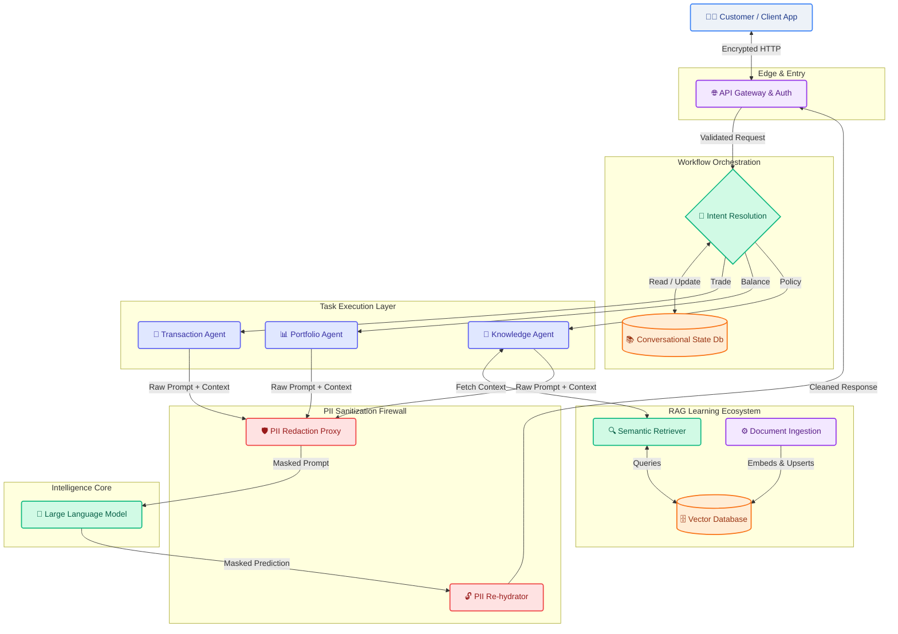

# Target State Architecture Vision

This document outlines the world-class final state architecture for RetireIQ. It encompasses all modular steps from customer interaction through intent resolution, security, RAG, and LLM processing.

## Enterprise AI Workflow Architecture

## Workflows Demystified

1. **Customer Interaction**: The user submits a natural language request via the app.
2. **Intent Resolution Engine**: A fast, low-latency classifier assesses if the user wants to trade, verify a balance, or just ask a policy question. It delegates the prompt to the correct **Task Agent**.
3. **Conversational Learning**: During intent routing, user preferences and immediate past conversational states are injected so the bot remembers if the user is upset, what they just asked, and their risk tolerance.
4. **Task Agents**: Dedicated workers handle specific logic. The `Knowledge Agent` specifically taps into the **RAG-Based Learning Ecosystem** to augment its prompt with the bank's latest policies.
5. **Continuous RAG Learning**: A background mechanism continuously embeds new Bank policy PDFs/documents so the vector database never goes stale. 
6. **PII Sanitization**: Before *any* context hits an external LLM, the firewall strips out numbers and names, mapping them in ephemeral memory. The LLM generates a mathematically optimal response using tokens, which the De-Redaction proxy rebuilds into a legible sentence for the Gateway to return.

---

> [!NOTE]  
> ## Enhancements Backlog (Gap Analysis)
> To achieve this final state from our current setup, the following enhancements need to be queued for implementation:
> 
> - [ ] **Implement Intent Resolution Layer**: Currently, we have a monolithic RAG router. We need a semantic router (langchain or native NLP) to dynamically choose *which* tool/agent to invoke based on the user's prompt.
> - [ ] **Upgrade Memory to 'Learning'**: Evolve the existing `Chat Memory` from standard N-turn tracking to a profile-learning model (extracting traits and saving long-term user facts to their DB profile).
> - [ ] **Vector Database Standup**: Ensure we have a dedicated Vector store integration (like PgVector or Pinecone) alongside an ingestion cron-job for "continuous learning", so policies are automatically updated without manual application deployments.
> - [ ] **Agentic Isolation**: Split our monolithic logic into distinct Agents (e.g., Transaction, Portfolio, Knowledge).
