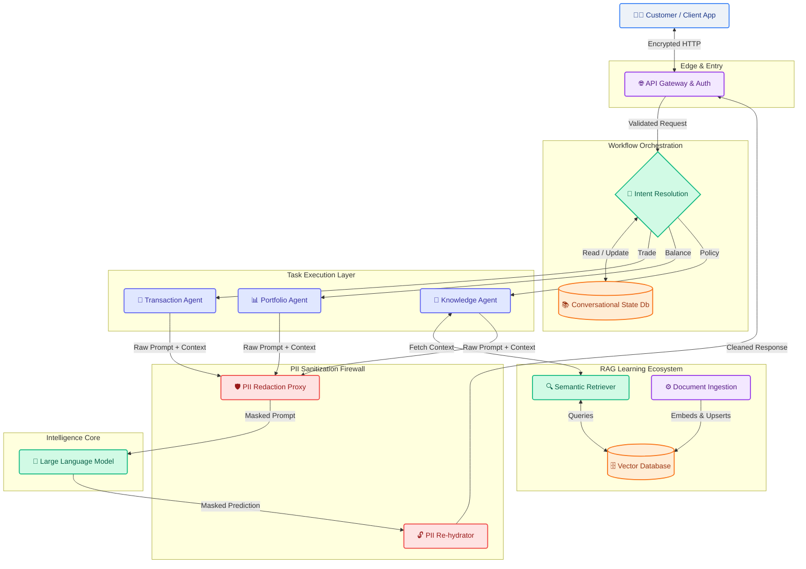

# Target State Architecture Vision

This document outlines the world-class final state architecture for RetireIQ. It encompasses all modular steps from customer interaction through intent resolution, security, RAG, and LLM processing.

## Enterprise AI Workflow Architecture

## 🧠 The Multi-Agent Ecosystem (MAS)

RetireIQ evolves from a single-reply chatbot into a collaborative ecosystem of specialized agents. Each agent is a "worker" with a specific domain of expertise, a dedicated toolset, and strict boundary constraints.

### 1. Intent Resolution Agent (The Dispatcher)
*   **Role**: The central nervous system of the chat session.
*   **Responsibilities**:
    *   **Semantic Routing**: Analyzes the user prompt (using low-latency models like Gemini 1.5 Flash) to identify if the intent is a query, a transaction, or a portfolio request.
    *   **Orchestration**: Delegates the task to the appropriate specialized agent.
    *   **Context Injection**: Ensures the chosen agent has the relevant snippets of short-term conversational history.

### 2. Knowledge Agent (The Scholar)
*   **Role**: The expert on all retirement policies, bank procedures, and regulatory documentation.
*   **Responsibilities**:
    *   **Semantic Retrieval**: Queries the **Vertex AI Vector Search** (or pgvector) to find relevant policy chunks.
    *   **Fact-Checking**: Ensures all AI-generated advice is grounded strictly in the retrieved documentation (RAG).
    *   **Policy Synthesis**: Simplifies complex financial jargon into clear, customer-friendly explanations.

### 3. Portfolio Agent (The Analyst)
*   **Role**: The quantitative expert for user financial data and retirement goal tracking.
*   **Responsibilities**:
    *   **Data Analysis**: Accesses the relational database to analyze account balances, asset allocations, and risk profiles.
    *   **Portfolio Generation**: Calculates recommended retirement paths based on extracted user traits.
    *   **Reporting**: Generates high-fidelity **PDF Portfolio Reports** for download and optional automated delivery via secure email.

### 4. Transaction Agent (The Executor)
*   **Role**: The highly-secure agent responsible for state-changing financial operations.
*   **Responsibilities**:
    *   **Tool Execution**: Invokes atomic tools for fund movements, account registration, or beneficiary updates.
    *   **Validation**: Ensures all "pre-flight" checks (balances, permissions) are met before executing a trade.
    *   **Auditing**: Generates detailed transaction logs for the internal bank audit trail.

### 5. PII Sanitization Agent (The Guardian)
*   **Role**: The real-time security firewall sitting between the agents and the Large Language Models.
*   **Responsibilities**:
    *   **Named Entity Redaction**: Detects and masks SSNs, account numbers, and names using NER and Regex.
    *   **Mapping**: Maintains a secure, ephemeral key-value map for "re-hydration."
    *   **De-Redaction**: Replaces LLM-generated tokens with the original sensitive data before the response is sent back to the customer.

### 6. Strategy Optimizer (The Visionary)
*   **Role**: The long-term projection expert.
*   **Responsibilities**:
    *   **Simulations**: Runs "What-If" scenarios and Monte Carlo models to predict retirement success.
    *   **Gap Analysis**: Identifies if the user is saving enough to meet their specific retirement date and lifestyle goals.

### 7. Market Oracle & Compliance Agent (The Shield)
*   **Role**: Real-time context and regulatory safety.
*   **Responsibilities**:
    *   **Live Context**: Injects real-time market data or news to help explain "Why" a portfolio is moving.
    *   **Audit**: Reviews responses for regulatory compliance, ensuring the system stays within the "Educational Guidance" boundary.

### 8. Multi-Modal Guardian (The Vision Agent)
*   **Role**: Non-textual data ingestion.
*   **Responsibilities**:
    *   **OCR/Vision**: Processes uploaded financial statements, competitor documents, or government forms to build a holistic user profile.
    *   **PII Masking**: Extends sanitization to images and PDF attachments.

### 9. RAG Evaluation Agent (The Fact-Checker)
*   **Role**: Final factual verification layer.
*   **Responsibilities**:
    *   **Self-Correction**: Evaluates the LLM's final response against the retrieved context to detect hallucinations or inaccuracies.
    *   **Source Citation**: Ensures every financial claim is backed by a specific line in the policy database.

### 10. Agent Audit Sentinel (The Historian)
*   **Role**: The "Black Box Recorder" for the ecosystem.
*   **Responsibilities**:
    *   **Traceability**: Intercepts every inter-agent communication and tool execution, logging them against the `SessionID`.
    *   **Financial Accountability**: Records why a specific recommendation was made, creating a "Paper Trail" for future audits.
    *   **Explainability**: Provides the raw data needed to generate "Why was I recommended this?" summaries for the user.

---

## 🚀 Elite Capabilities (Best-of-Kind)
To reach the pinnacle of AI financial assistants, RetireIQ implements:
- **Comprehensive Audit Trails**: Total visibility into agentic decision-making, indexed by session.
- **Proactive Nudging**: AI "looks ahead" to find tax-saving or growth opportunities without being asked.
- **Human-in-the-Loop (HITL)**: Seamless handoff to human advisors for high-complexity decisions.
- **Emotional Empathy Detection**: Adjusts tone and detail level based on detected user sentiment (stress, excitement, urgency).

---

## Workflows Demystified

1. **Customer Interaction**: The user submits a natural language request via the app.
2. **Intent Resolution Engine**: A fast, low-latency classifier assesses if the user wants to trade, verify a balance, or just ask a policy question. It delegates the prompt to the correct **Task Agent**.
3. **Conversational Learning**: During intent routing, user preferences and immediate past conversational states are injected so the bot remembers if the user is upset, what they just asked, and their risk tolerance.
4. **Task Agents**: Dedicated workers handle specific logic. The `Knowledge Agent` specifically taps into the **RAG-Based Learning Ecosystem** to augment its prompt with the bank's latest policies.
5. **Continuous RAG Learning**: A background mechanism continuously embeds new Bank policy PDFs/documents so the vector database never goes stale. 
6. **PII Sanitization**: Before *any* context hits an external LLM, the firewall strips out numbers and names, mapping them in ephemeral memory. The LLM generates a mathematically optimal response using tokens, which the De-Redaction proxy rebuilds into a legible sentence for the Gateway to return.

---

> [!NOTE]  
> ## Enhancements Backlog (Gap Analysis)
> To achieve this final state from our current setup, the following enhancements need to be queued for implementation:
> 
> - [ ] **Implement Intent Resolution Layer**: Currently, we have a monolithic RAG router. We need a semantic router (langchain or native NLP) to dynamically choose *which* tool/agent to invoke based on the user's prompt.
> - [ ] **Upgrade Memory to 'Learning'**: Evolve the existing `Chat Memory` from standard N-turn tracking to a profile-learning model (extracting traits and saving long-term user facts to their DB profile).
> - [ ] **Vector Database Standup**: Ensure we have a dedicated Vector store integration (like PgVector or Pinecone) alongside an ingestion cron-job for "continuous learning", so policies are automatically updated without manual application deployments.
> - [ ] **Agentic Isolation**: Split our monolithic logic into distinct Agents (e.g., Transaction, Portfolio, Knowledge).
