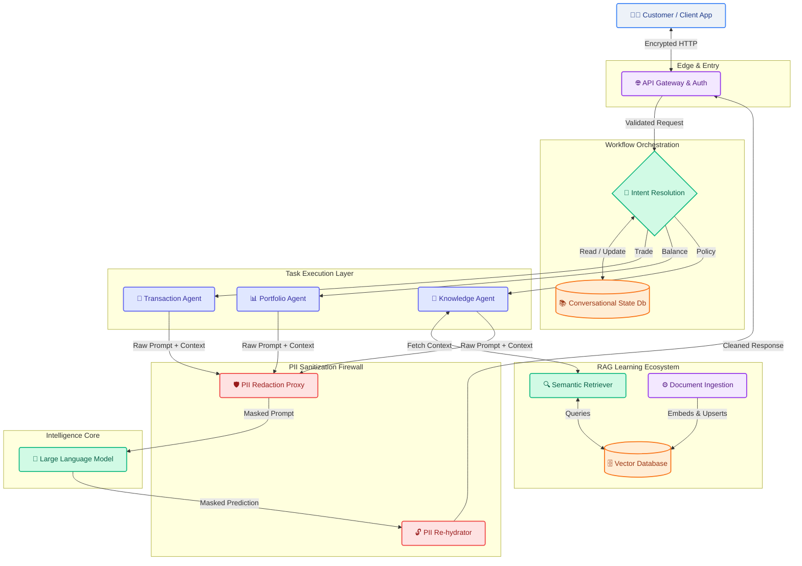

# Target State Architecture Vision

This document outlines the world-class final state architecture for RetireIQ. It encompasses all modular steps from customer interaction through intent resolution, security, RAG, and LLM processing.

## Enterprise AI Workflow Architecture

## 🧠 The Multi-Agent Ecosystem (MAS)

RetireIQ evolves from a single-reply chatbot into a collaborative ecosystem of specialized agents. Each agent is a "worker" with a specific domain of expertise, a dedicated toolset, and strict boundary constraints.

### 1. Intent Resolution Agent (The Dispatcher)
*   **Role**: The central nervous system of the chat session.
*   **Responsibilities**:
    *   **Semantic Routing**: Analyzes the user prompt (using low-latency models like Gemini 1.5 Flash) to identify if the intent is a query, a transaction, or a portfolio request.
    *   **Orchestration**: Delegates the task to the appropriate specialized agent.
    *   **Context Injection**: Ensures the chosen agent has the relevant snippets of short-term conversational history.

### 2. Knowledge Agent (The Scholar)
*   **Role**: The expert on all retirement policies, bank procedures, and regulatory documentation.
*   **Responsibilities**:
    *   **Semantic Retrieval**: Queries the **Vertex AI Vector Search** (or pgvector) to find relevant policy chunks.
    *   **Fact-Checking**: Ensures all AI-generated advice is grounded strictly in the retrieved documentation (RAG).
    *   **Policy Synthesis**: Simplifies complex financial jargon into clear, customer-friendly explanations.

### 3. Portfolio Agent (The Analyst)
*   **Role**: The quantitative expert for user financial data and retirement goal tracking.
*   **Responsibilities**:
    *   **Data Analysis**: Accesses the relational database to analyze account balances, asset allocations, and risk profiles.
    *   **Portfolio Generation**: Calculates recommended retirement paths based on extracted user traits.
    *   **Reporting**: Generates high-fidelity **PDF Portfolio Reports** for download and optional automated delivery via secure email.

### 4. Transaction Agent (The Executor)
*   **Role**: The highly-secure agent responsible for state-changing financial operations.
*   **Responsibilities**:
    *   **Tool Execution**: Invokes atomic tools for fund movements, account registration, or beneficiary updates.
    *   **Validation**: Ensures all "pre-flight" checks (balances, permissions) are met before executing a trade.
    *   **Auditing**: Generates detailed transaction logs for the internal bank audit trail.

### 5. PII Sanitization Agent (The Guardian)
*   **Role**: The real-time security firewall sitting between the agents and the Large Language Models.
*   **Responsibilities**:
    *   **Named Entity Redaction**: Detects and masks SSNs, account numbers, and names using NER and Regex.
    *   **Mapping**: Maintains a secure, ephemeral key-value map for "re-hydration."
    *   **De-Redaction**: Replaces LLM-generated tokens with the original sensitive data before the response is sent back to the customer.

### 6. Strategy Optimizer (The Visionary)
*   **Role**: The long-term projection expert.
*   **Responsibilities**:
    *   **Simulations**: Runs "What-If" scenarios and Monte Carlo models to predict retirement success.
    *   **Gap Analysis**: Identifies if the user is saving enough to meet their specific retirement date and lifestyle goals.

### 7. Market Oracle & Compliance Agent (The Shield)
*   **Role**: Real-time context and regulatory safety.
*   **Responsibilities**:
    *   **Live Context**: Injects real-time market data or news to help explain "Why" a portfolio is moving.
    *   **Audit**: Reviews responses for regulatory compliance, ensuring the system stays within the "Educational Guidance" boundary.

### 8. Multi-Modal Guardian (The Vision Agent)
*   **Role**: Non-textual data ingestion.
*   **Responsibilities**:
    *   **OCR/Vision**: Processes uploaded financial statements, competitor documents, or government forms to build a holistic user profile.
    *   **PII Masking**: Extends sanitization to images and PDF attachments.

### 9. RAG Evaluation Agent (The Fact-Checker)
*   **Role**: Final factual verification layer.
*   **Responsibilities**:
    *   **Self-Correction**: Evaluates the LLM's final response against the retrieved context to detect hallucinations or inaccuracies.
    *   **Source Citation**: Ensures every financial claim is backed by a specific line in the policy database.

### 10. Agent Audit Sentinel (The Historian)
*   **Role**: The "Black Box Recorder" for the ecosystem.
*   **Responsibilities**:
    *   **Traceability**: Intercepts every inter-agent communication and tool execution, logging them against the `SessionID`.
    *   **Financial Accountability**: Records why a specific recommendation was made, creating a "Paper Trail" for future audits.
    *   **Explainability**: Provides the raw data needed to generate "Why was I recommended this?" summaries for the user.

---

## 🚀 Elite Capabilities (Best-of-Kind)
To reach the pinnacle of AI financial assistants, RetireIQ implements:
- **Comprehensive Audit Trails**: Total visibility into agentic decision-making, indexed by session.
- **Proactive Nudging**: AI "looks ahead" to find tax-saving or growth opportunities without being asked.
- **Human-in-the-Loop (HITL)**: Seamless handoff to human advisors for high-complexity decisions.
- **Emotional Empathy Detection**: Adjusts tone and detail level based on detected user sentiment (stress, excitement, urgency).

---

## Workflows Demystified

1. **Customer Interaction**: The user submits a natural language request via the app.
2. **Intent Resolution Engine**: A fast, low-latency classifier assesses if the user wants to trade, verify a balance, or just ask a policy question. It delegates the prompt to the correct **Task Agent**.
3. **Conversational Learning**: During intent routing, user preferences and immediate past conversational states are injected so the bot remembers if the user is upset, what they just asked, and their risk tolerance.
4. **Task Agents**: Dedicated workers handle specific logic. The `Knowledge Agent` specifically taps into the **RAG-Based Learning Ecosystem** to augment its prompt with the bank's latest policies.
5. **Continuous RAG Learning**: A background mechanism continuously embeds new Bank policy PDFs/documents so the vector database never goes stale. 
6. **PII Sanitization**: Before *any* context hits an external LLM, the firewall strips out numbers and names, mapping them in ephemeral memory. The LLM generates a mathematically optimal response using tokens, which the De-Redaction proxy rebuilds into a legible sentence for the Gateway to return.

---

> [!NOTE]
> ## Implementation Status (Gap Analysis → Delivered)
> The enhancements below were originally identified as gaps. All core items are now complete.
>
> - [x] **Intent Resolution Layer**: Semantic Dispatcher in `orchestrator.py` (Gemini Flash, T=0.0). Classifies KNOWLEDGE_BASE / PORTFOLIO_ANALYSIS / TRANSACTIONAL / GENERAL.
> - [x] **Memory → Learning**: `UserMemory` model + `summarize_into_facts` background task extracts permanent preferences from every conversation.
> - [x] **Vector Database**: pgvector integrated into PostgreSQL with HNSW indexing. Vertex AI `text-embedding-004` available for cloud deployments.
> - [x] **Agentic Isolation**: Scholar, Analyst, Executor, and Guardian agents all implemented with dedicated context boundaries.
> - [x] **Bank-Grade Audit Trail**: `AgentAudit` model + `AuditService` (The Historian) records every THOUGHT/ACTION/OBSERVATION/RESPONSE.
> - [x] **Real-time SSE Streaming**: Thread-safe `SSEService` broadcasts agentic reasoning to the client in < 10ms.
> - [x] **Vertex AI + Context Caching**: Gemini 1.5 Pro/Flash deployed. `VertexCacheManager` achieves up to 90% token reduction.
> - [x] **Production Hardening**: All large functions refactored. Structured logging everywhere.
- [x] **Sentinel (Compliance Gate)**: Deterministic pre-trade checks (Concentration, Suitability, Age) delivered.
- [x] **Actuarial (Monte Carlo Simulation)**: 10,000 scenario simulations for retirement success delivered.

---

## 🚀 Phase 7: The Autonomous Agent Ecosystem (Roadmap)

The current MAS covers the **reactive** dimension well. Phase 7 adds **proactive**, **preventive**, and **predictive** capabilities through 8 specialist agents.

### 🔴 Priority 1 — Regulatory & Core Differentiation (Must-have)

#### ⚖️ The Sentinel (Pre-Trade Compliance Agent)
- **Problem**: The Executor can place trades, but no regulated firm allows this without a compliance layer. Without the Sentinel, RetireIQ cannot legally hold an FCA/FINRA licence.
- **How it works**: Every TRANSACTIONAL intent passes through a rules engine validating suitability profile, AML watchlists, concentration limits, and jurisdiction restrictions. Returns PASS / WARN / BLOCK with a compliance reasoning trail written to `AgentAudit`.
- **Stack**: Python rules engine, ComplyAdvantage AML API, compliance policy store.

#### 📊 The Actuarial (Monte Carlo Simulation Agent)
- **Problem**: Can RetireIQ answer the most important retirement question — *"Will I actually have enough money?"*
- **How it works**: 10,000+ scenario simulations sampling from log-normal return distributions, modelling inflation, longevity risk, and sequence-of-returns. Output: *"78% probability of not outliving savings to age 90."*
- **Stack**: NumPy, SciPy (distributions), Plotly (confidence bands), actuarial life tables.

---

### 🟡 Priority 2 — User Experience & Retention (High Value)

#### 🧾 The Vision (Document Ingestion Agent)
- **Problem**: Years of financial history are locked in PDFs. Manual onboarding takes hours.
- **How it works**: OCR (Google Document AI / Tesseract) + Gemini 1.5 Pro long-context parsing. Collapses 2-hour manual onboarding into 2 minutes. Guardian scrubs PII before storage.
- **Stack**: Google Document AI, Pillow, Gemini 1.5 Pro.

#### 🧠 The Empath (Behavioral Finance Agent)
- **Problem**: Panic selling and FOMO destroy more retirement savings than poor market selection.
- **How it works**: Real-time sentiment analysis on every message. Detects panic/FOMO signals, dynamically adjusts LLM tone, flags high-risk emotional decisions to the Sentinel.
- **Stack**: VADER Sentiment / Gemini Flash, rule-based bias patterns, dynamic system prompt injection.

#### 🗓️ The Concierge (Proactive Outreach Agent)
- **Problem**: Tax deadlines, ISA resets, and RMD dates pass silently and cost users money.
- **How it works**: Personalised event calendar + scheduled background scan. Proactive SSE, email, and SMS alerts for upcoming financial opportunities.
- **Stack**: APScheduler, PostgreSQL event store, SendGrid, Twilio.

---

### 🟢 Priority 3 — Enterprise & Strategic (Long-term)

#### 🔮 The Oracle (Market Intelligence Agent)
- **Problem**: RetireIQ has no awareness of real-world market events affecting the user's portfolio.
- **How it works**: Real-time market data feeds (yfinance) cross-referenced with user holdings. Triggers Concierge alerts on threshold breaches.
- **Stack**: APScheduler, yfinance / Alpha Vantage, Gemini Flash, Celery.

#### 🗳️ The Debater (Ensemble Reasoning Agent)
- **Problem**: For high-stakes decisions (>20% portfolio impact), a single model error is catastrophic.
- **How it works**: Spawns 3 independent agents across different models (Gemini Pro, GPT-4o, Llama3) and framing perspectives (bull/bear/neutral). A Moderator synthesises their disagreements.
- **Stack**: Python threading (parallel), Gemini Pro + GPT-4o + Llama3, consensus scoring.

#### 🕵️ The Forensic (Fraud Detection Agent)
- **Problem**: A transaction-executing platform is a fraud target.
- **How it works**: Isolation Forest anomaly detection on transaction features (velocity, geo-delta, z-score size). BLOCK + human escalation on high-risk scores.
- **Stack**: scikit-learn (Isolation Forest), GeoIP2, Redis (velocity), PagerDuty.
